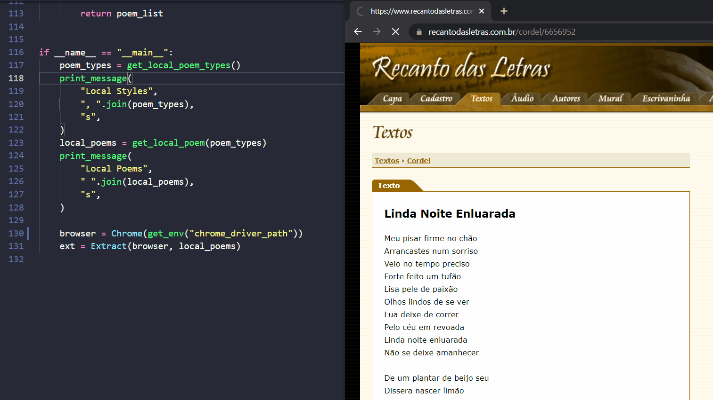
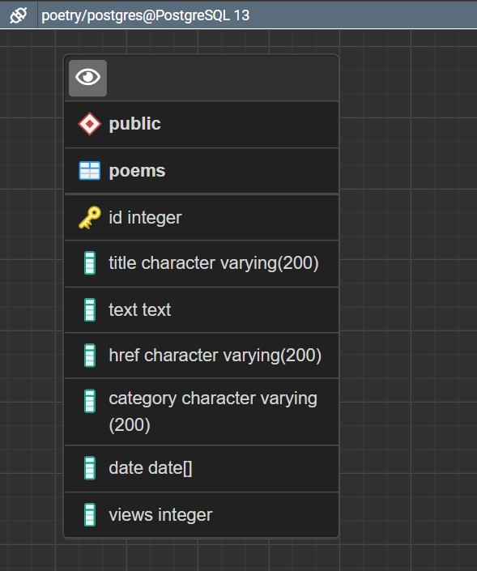

## 🤖🧰 Web Scraping | [Recanto das Letras](https://www.recantodasletras.com.br/) 📓✒
### [Read in English here](README-en.md).


Projeto **Web Scraping** **Python** para o site Recanto das Letras, rede social de compartilhamento de contos, poesias e textos em geral.

_**Web Scraping** **Python** project for the Recanto das Letras website, a social network for sharing stories, poetry and texts in general._

[](https://creativecommons.org/licenses/by-nc-sa/4.0/legalcode)

[](https://www.psycopg.org/) [](https://www.sqlalchemy.org/) [](https://www.selenium.dev/documentation/en/selenium_installation/installing_selenium_libraries/) [](https://pandas.pydata.org/) [](https://numpy.org/)



## Recursos

 - Coleta e cataloga **todos os textos** de um **perfil pessoal**, armazenando os seguintes dados dos textos:
   - id [gerado automaticamente]
   - Título;
   - Conteúdo do texto;
   - URL para texto;
   - Categoria;
   - Data de publicação;
   - Visualizações.
 - Armazena em servidor **PostgreSQL**.



## Para Adicionar

 - Coleta de outros perfis.

# Executando 🏁

 1. Baixe o webdriver para uso da biblioteca Selenium, disponível [aqui](https://chromedriver.chromium.org/downloads).
 2. Crie um arquivo `.env` na pasta raiz do repositório contendo as seguintes informações:

```python
# Login Recanto das Letras
user =   # Usuário
password =   # Senha

# Webdriver
chrome_driver_path =   # Caminho para Webdriver (p.ex. C:\Users\user\.google\chromedriver.exe)

# PostgreSQL
user_db =   # Usuário do Banco de Dados
password_db =   # Senha
host_db =   # Host (localhost)
port_db =   # Porta
database_db =   # Banco de Dados destino
```
 3. Instale as dependências e execute.

```
$ pip install -r requirements.txt
$ python getpoetry/main.py
```

# Teste 🚧

 - Instale as dependências de desenvolvedor.

```
$ pip install -r requirements-dev.txt
$ pytest getpoetry
```
